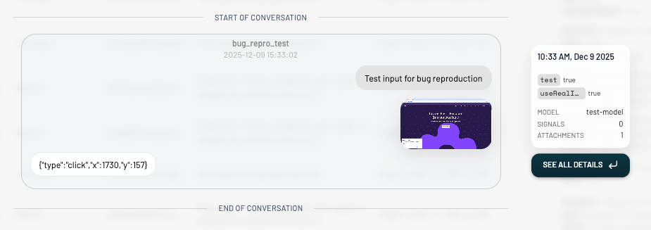
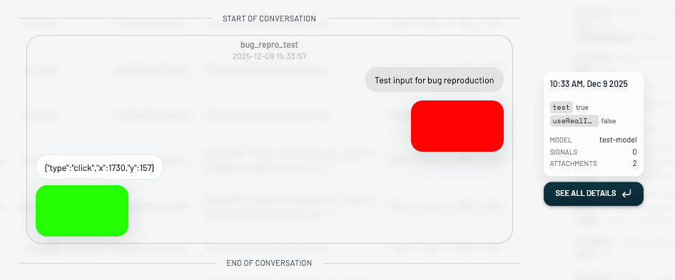
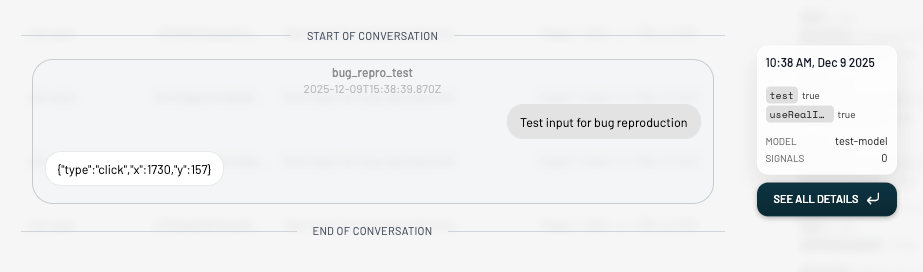

# Raindrop SDK Bug Reproduction

Minimal reproduction case for a bug in `raindrop-ai@0.0.69`.

## Setup

```bash
pnpm install
cp .env.example .env  # Add your RAINDROP_WRITE_KEY
```

## Run

There are two modes to run this reproduction:

### Synthetic Images (works)

```bash
pnpm repro
```

This mode generates small synthetic PNG images in-memory for the input screenshot and output click target attachments. When you check the Raindrop UI, the event shows **both attachments** correctly.

### Real Images (doesn't work)

```bash
pnpm repro:real
```

This mode uses the actual screenshots from the `data/` subfolder (`input-screenshot.png` and `output-click-target.png`). When you check the Raindrop UI, the event shows **only one attachment** — the output attachment is lost.

### Real Images without Sleeps (even worse)

```bash
pnpm repro:real:no-sleeps
```

This mode uses real images but skips all the simulated delays. When you check the Raindrop UI, the event shows **zero attachments** — both attachments are lost.

## The Bug

Both modes perform the same sequence of operations:

1. Begin an interaction
2. Add first attachment (input screenshot)
3. Perform a slow operation (>2 seconds)
4. Add second attachment (output click target)
5. Finish the interaction

**Expected:** Final event in Raindrop UI has 2 attachments (screenshot + click_target)

**Actual with real images:** Final event has only 1 attachment (screenshot) — the output attachment is missing

## Screenshots

### Real Images (`useRealImages: true`) — BUG



Notice: `ATTACHMENTS: 1` — the output click target attachment is missing, only the input screenshot is shown.

### Synthetic Images (`useRealImages: false`) — WORKING



Notice: `ATTACHMENTS: 2` — both the input (red) and output (green) synthetic images are present.

### Real Images + No Sleeps — ZERO ATTACHMENTS



Notice: No attachments at all — both the input and output images are completely lost when there are no delays between operations.

## Environment

- Node.js: v20+
- raindrop-ai: 0.0.69
